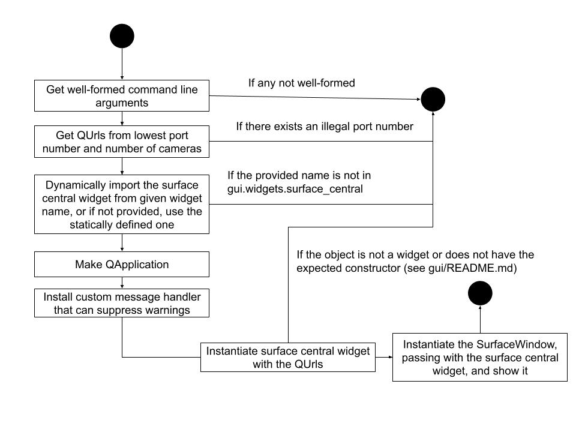

# surface

This folder is responsible all code and assets related to the top-side machine,
in which there are three main parts:
- Controller: How input is read from a device, and sent to bottom-side to move
  the robot.
- GUI: A GUI app.
- Sturgeon: Parsing and rendering data via a diagram.

## CLI

To launch the controller,
```sh
python -m ./surface_client
```
(Or `python3` instead of `python` depending on your environment variables.)

To launch the surface GUI app,
```sh
./launch -p <PORT NUM> -n <NUM CAMERAS>
```
One can add `-s` flag to show surpressed messages. One can also add 
`-w <Widget Name>` which locates the surface central to be used in
`./gui/widgets/surface_central.py`.

Let `<PORT NUM>` and `<NUM CAERMAS>` be `p` and `n` respectively. Then, the
ports `p`, `p+1`, ..., `p+n-1` will be used for the cameras. If there exists an
invalid port, the program will shut down with a descriptive error message,
tellin you so.

## Directory Structure
- `common`: Contains code whose purpose cuts across the submodules present in this
  directory.
- `ESP32WifiTest`: Contains exploratory code for ESP32 Wifi.
- `__init__.py`: To make this directory a Python package. Do not delete.
- `tests`: Contains test for code in this directory.

### Controller
- `surface_client.py`: The entry point for the program to read user input from
  the controller and sends the movement data to the pi.
- `joystick.py`: Defines code that reads user input from XBox controller into numbers.
- `pygame_joystick_example.py`: Contains reference code for working with pygame.

### GUI
- `xgui`: The script to launch the GUI.
- `xgui.py`: The code which `xgui` calls into.
- `gui`: Responsible for defining PyQt5 GUI elements.
- `surpressed_qt_messages.txt`: Qt messages that should not be logged. Each line
  is one message.

### Sturgeon
- `sturgeon_test.csv`: Raw data for sturgeon.
- `sturgeon_test.py`: Exploratory code that parses the raw data into a visual diagram.

## Tests
Run
```sh
./xtest
```

### Manual Testing

1. To get video data streamed into the ports, either: 
    * Follow the instructions in the [How to Stream Video
   Guide](../pi/how_to_stream_video.txt).
    * To use the video from a recording device on your machine, or GST's test
    video source, respectively, run one of
```sh
gst-launch-1.0 v4l2src device=/dev/<YOUR DEVICE> ! videoconvert ! x264enc tune=zerolatency bitrate=500 speed-preset=superfast ! rtph264pay ! udpsink host=127.0.0.1 port=<YOUR PORT NUMBER>
```

```sh
gst-launch-1.0 videotestsrc ! x264enc ! video/x-h264, stream-format=byte-stream ! rtph264pay ! udpsink host=127.0.0.1 port=<YOUR PORT NUMBER>
```
2. Repeat step 1 `n-1` more times where `n` is the number of cameras you would
   like to test and is in the range `[1,4]`. The port numbers must be adjacent!
   For example, ports `5000` and `5001` are fine, whereas ports `5000` and
   `5002` are not.
3. Launch the `xgui` script with the `CLI` instructions above, where the port
   number should be the lowest number of the adjacen port numbers you used, and
   the number of cameras is the value `n` you decided earlier.
   
Steps 1-2 and step 3 are interchangeable.

## GUI

This is a UML activity diagram that summarizes the control flow `./xgui.py`.



You may modify the diagram in the link below, but be sure to download it as a
JPG and replace the current JPG under the same name. 
https://docs.google.com/drawings/d/1sxUdhup1p8CZiSeZzCpBNy8SAKoo_eIB_ZVpaZL_PD8/edit?usp=sharing

### Surpressed Warnings
```
QWidget::paintEngine: Should no longer be called
```
This spams the stderr port  when resizing video player widget while a
video is shown. According to [this forum
discussion](https://forum.qt.io/topic/122732/qwidget-paintengine-should-no-longer-be-called),
this is a bug and can be safely ignored. Once this bug has been fixed, we can
remove this.


## Regressions

The previous implementation was able to:
- Take a picture on a single camera and save it to the top-side's file system.
- Save a recording of a single camera and save it to the top-side's file system.
- Stream a cropped version of the video feed.

To see the previous implementation, go to [this
commit](https://github.com/NEURoboticsClub/neu-underwater-robotics/tree/9633a4fee176d9314d47b826078086eee773c8c9),
and navigate to `surface/video/`. Everything in there is the old implementation.
