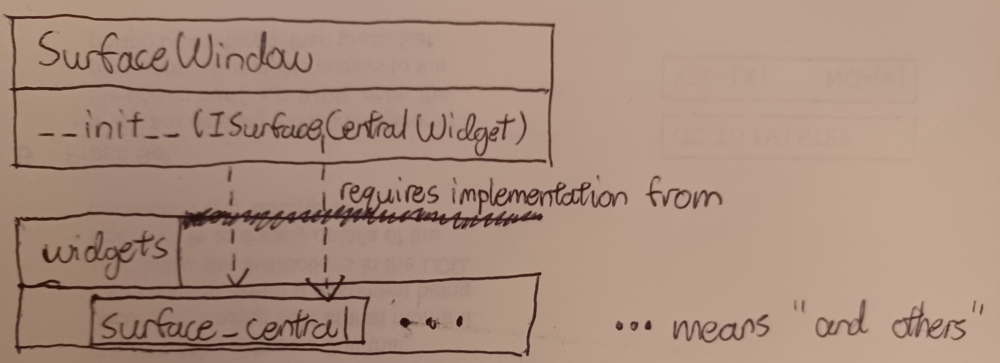

# gui

This package is responsible for custom PyQt5 GUI elements created and used by
the surface machine.

The `SurfaceWindow` is currently not very interesting, but it is idiomatic for
PyQt5 apps to launch a window, as a window offers functionality that cannot be
found in regular widgets.

All defined widgets are encapsulated in the `.widgets` submodule, but
`.widgets.surface_central` is of special interest as it defines the main layout
of the window.

## Directory Structure

- `__init__.py`: This is so that this directory is a package. Do not delete.
- `surface_window.py`: Defines the main window to be used as for our PyQt5
  application.
- `widgets`: Defines custom PyQt5 widgets to be used for our application.

## Details

