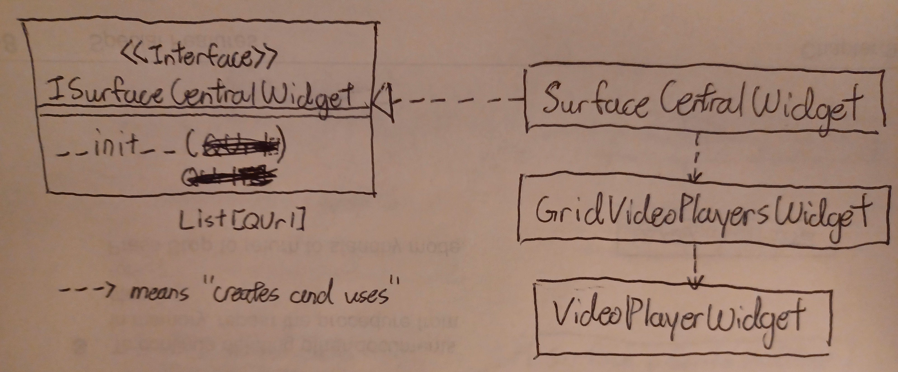

# widgets

This package is responsible for defining custom PyQt5 widgets.

## Directory Structure
- `__init__.py`: So that this directory is a package. Do not delete.
- `tests`: Contains the code for running the tests.
- `xtest`: The script for running unit tests.
- `surface_central.py`: The widget which defines the main layout of our
  application.
- `grid_video_players.py`: Defines a grid of 1-4 video players.
- `video_player.py`: The widget that streams video data into a video widget.

## Tests
Run
```sh
./xtest
```

## Details


